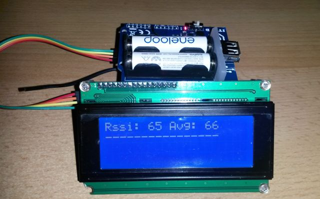
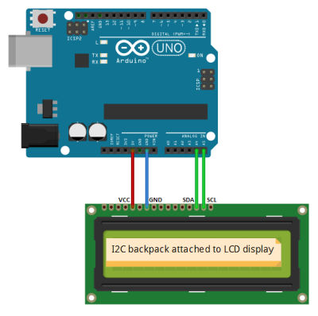

Ciseco Range Tester
=================

**Ciseco Range Tester** is Arduino device to measure link quality and more importantly possible link length between two [Ciseco RF transmitters](http://shop.ciseco.co.uk/rf-module-range/) – local (master) and remote (slave).

It is reusing built-in feature when remote node, [put into a special mode](http://www.openmicros.org/index.php/articles/84-xrf-basics/146-rssimode), replies with incoming RSSI level.

Replied RSSI value and average RSSI over multiple measurements is displayed on LCD screen together with kind of a bar where each – (minus character) represents received packet. Screen content is optimized for 16x2 LCD size.

 
The difference is that this device is to replace PC, as a master node, so it is more portable. 

Chosen I2C LCD display is cheap, highly available on Ebay, Deal Extreme, etc and included in many Arduino starter kits. 

## How to setup remote end (slave): ##
Configure on your PC using XCM or AT commands

1. Change ATNT (node type) to 4 (ATNT4)
2. Write to permanent memory (ATWR) – *this is optional step. If omitted, node returns to previous mode when restarted*
3. Close the session (ATDN)

Written and tested in Arduino 1.5.8 IDE
TESTED with XinoRF and SainSmart I2C 20x4 LCD Screen. Content is optimized for 16x2 screen size, so it should not be a problem using d16x2 display size, just change DISPLAY_ROWS and DISPLAY_COLUMNS constants.

## Circuit Wiring ##

**The wiring is more circuit outline than real a real wiring.*

## License ##
The MIT License

Copyright (c) 2014, Michal FOKSA, source [at] michalfoksa [dot] net

See [LICENSE.txt](./LICENSE.txt "LICENSE") for details.

